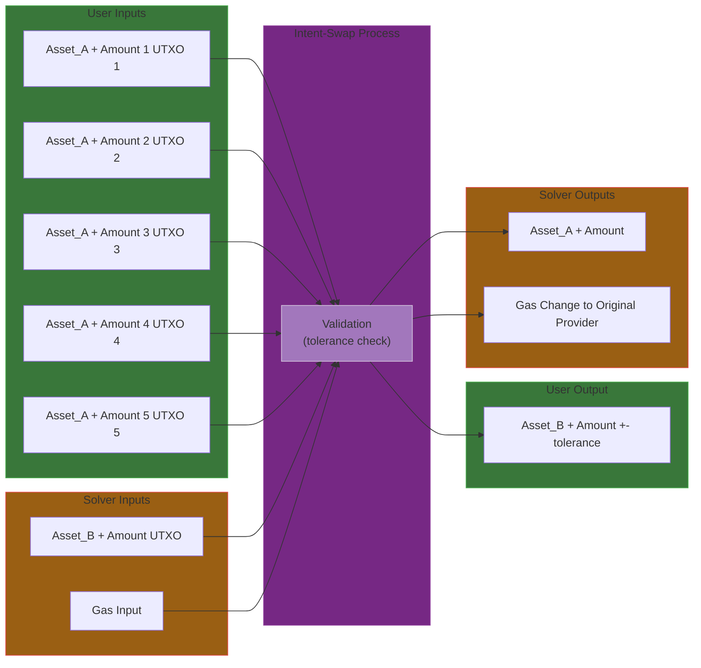

# Intent-Swap

A decentralized intent-based swap implementation in Sway. This project is a product of EIP-712 research and development on Fuel.

## Overview

Intent-Swap enables users to express trading intentions through signed messages, which are then executed by transaction builders. This architecture separates intent declaration from the building of the transaction, allowing for more flexible transaction desires to be expressed by users. The below mechanism allows users to effectively
pre-sign the spending of UTXOs from assets locked at predicates owned by the user.

## How It Works

1. **Intent Declaration**: A user signs an Intent specifying:
   - Desired input asset utxos and amounts
   - Expected output assetid and amount
   - Acceptable price tolerance
   - Signature for verification

   Let $I$ be the intent struct signed by the owner
   Let $Sig$ be the signature provided

2. **Intent Publication**: The signed intent can be published through various channels:
   - On-chain as a message or contract call
   - Off-chain to a mempool or dark pool
   - Directly to relayers or solvers

3. **Execution**: Transaction builders monitor published intents, construct valid transactions that satisfy the original intent, and submit them to the blockchain.

   Let $S$ be the set of struct data passed by the tx builder
   Let $T$ be the set of actual transaction inputs and outputs
   Let $H$ be the hash function

4. **Validation**: A smart contract or predicate verifies the transaction matches the user's original intent before execution.


   Step 1: Struct Data Matching

<div align="center">

$$\forall s \in S, \exists t \in T : s \equiv t$$

</div>

   Step 2: Transaction Details Validation

<div align="center">

$$
\begin{align*}
H(T) &\equiv H(I) \\
Verify(Sig, H(T)) &= true
\end{align*}
$$

 </div>


   The transaction is valid if and only if:

<div align="center">

$$
(\text{Step 1 is true}) \land (\text{Step 2 is true})
$$

 </div>

See brief [formal spec](spec/formal_definition.pdf)


## Core Data Structures

```sway
pub struct Intent {
    /// The address of the intent signer
    pub sender: b256,
    /// The compact signature for intent verification
    pub compsig: Bytes,
    /// The input/output specification
    pub io: GenIO,
}

pub struct GenIO {
    /// Array of input asset ids (up to 5)
    pub inputassets: [b256; 5],
    /// Array of input UTXO ids (up to 5)
    pub inpututxoids: [b256; 5],
    /// Array of input amounts (as U256) (up to 5)
    pub inputamounts: [b256; 5],
    /// The desired output asset id
    pub outputasset: b256,
    /// The desired output amount
    pub outputamount: b256,
    /// Maximum acceptable price deviation in bps
    pub tolerance: b256,
}
```

## Features

- EIP-712 compatible intent signing
- Support for multiple input assets
- Configurable price tolerance
- Flexible intent distribution channels
- On-chain intent validation


## Swap Transaction

<div align="center">



</div>


