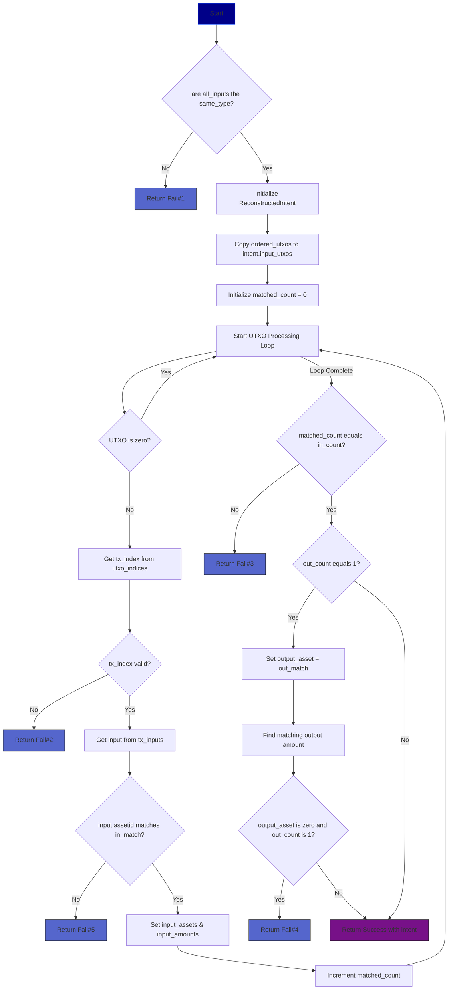

```mermaid
flowchart TD
    A[Start] --> B{are all_inputs the same_type?}
    B -->|No| C[Return Fail#1]
    B -->|Yes| D[Initialize ReconstructedIntent]
    
    D --> E[Copy ordered_utxos to intent.input_utxos]
    
    E --> F[Initialize matched_count = 0]
    
    F --> G[Start UTXO Processing Loop]
    
    G --> H{UTXO is zero?}
    H -->|Yes| G
    H -->|No| I[Get tx_index from utxo_indices]
    
    I --> J{tx_index valid?}
    J -->|No| K[Return Fail#2]
    J -->|Yes| L[Get input from tx_inputs]
    
    L --> M{input.assetid matches in_match?}
    M -->|No| N[Return Fail#5]
    M -->|Yes| O[Set input_assets & input_amounts]
    
    O --> P[Increment matched_count]
    P --> G
    
    G -->|Loop Complete| Q{matched_count equals in_count?}
    Q -->|No| R[Return Fail#3]
    
    Q -->|Yes| S{out_count equals 1?}
    S -->|Yes| T[Set output_asset = out_match]
    T --> U[Find matching output amount]
    
    U --> V{output_asset is zero and out_count is 1?}
    V -->|Yes| W[Return Fail#4]
    V -->|No| X[Return Success with intent]
    
    S -->|No| X
    
    style A fill:#008,stroke:#25f
    style X fill:#718,stroke:#333
    style C fill:#56c,stroke:#333
    style K fill:#56c,stroke:#333
    style N fill:#56c,stroke:#333
    style R fill:#56c,stroke:#333
    style W fill:#56c,stroke:#333
```